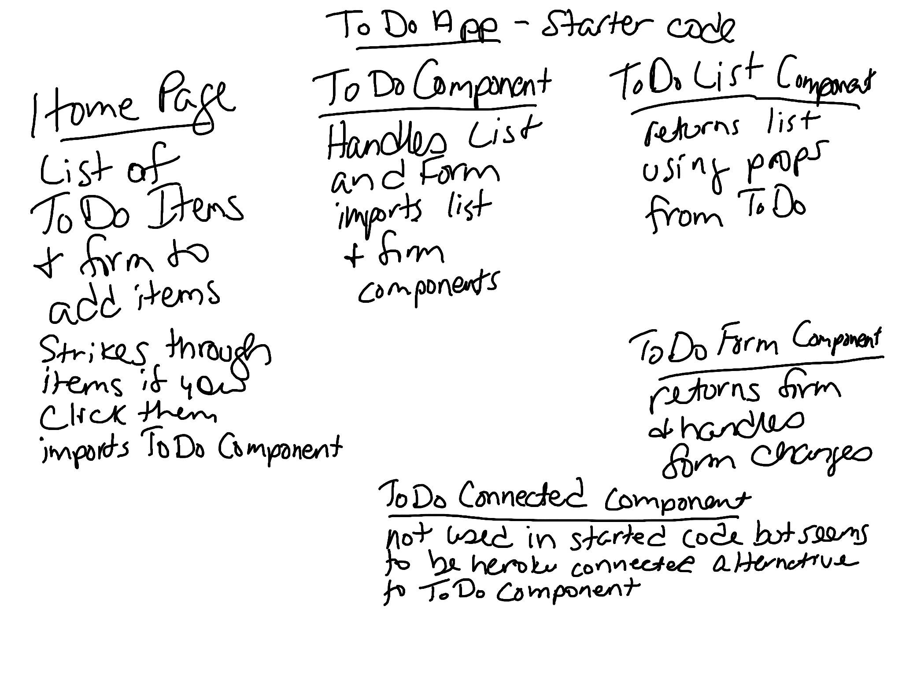

# todo

This project contains a todo list application.

### Author: Marlene Rinker

<!-- - [Submission PR](https://github.com/marlenerinker-401-advanced-javascript/resty/pull/7)
- [Tests Report](https://github.com/marlenerinker-401-advanced-javascript/resty/actions)
- [GitHub Pages deployment](https://marlenerinker-401-advanced-javascript.github.io/resty/) -->

### Setup

#### `.env` requirements
No `.env` requirements at this time.

#### Packages to Install
(See package.json)
node-sass": "^4.14.1",
    "react": "16.13.1",
    "react-dom": "16.13.1",
    "react-jsonschema-form": "1.8.1",
    "react-router-dom": "5.2.0",
    "react-scripts": "3.4.1",
    "uuid": "8.1.0"

<!-- - eslint-plugin-react -->
- node-sass
- react
- react-dom
- react-scripts
- react-router-dom
- uuid
- react-jsonschema-form
- react-bootstrap
- bootstrap
<!-- - enzyme
- enzyme-adapter-react-16
- gh-pages
- react-test-renderer  -->

#### Running the app
npm start

#### Tests

<!-- - Unit Tests: `npm test` (run from the `__tests__` folder to run all tests)

- Assertions Made: -->
  <!-- -  --> 

#### UML
